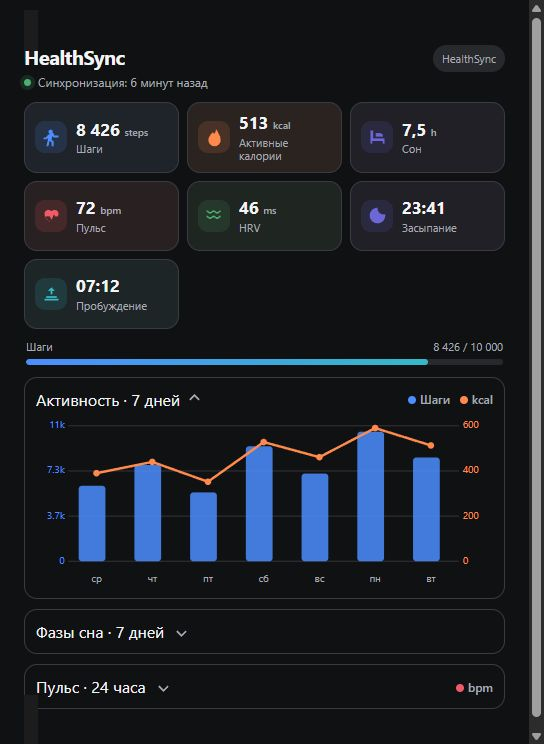

[Original README in English](README.md)

# HealthSync Dashboard Card



Компактная адаптивная карточка Home Assistant для
[интеграции HealthSync](https://github.com/mannotfood/healthsync). Карточка использует
штатные сенсоры интеграции и историю Recorder, не требуя сторонних frontend-зависимостей.

> Это независимый проект сообщества, не связанный с автором HealthSync.

## Возможности

- Автоматическое обнаружение стандартных сущностей HealthSync
- Графический редактор Home Assistant и ручная замена любой сущности
- Независимое включение и выключение каждой плитки показателя
- Шаги, активные калории, пульс, HRV и сводка сна
- Время засыпания и пробуждения
- Индикатор дневной цели шагов
- Раздельные шкалы шагов и калорий
- График пульса за 24 часа прямыми от точки к точке
- Крупные подсказки со временем получения измерения
- График фаз сна из атрибутов `deep_minutes`, `core_minutes`, `rem_minutes` и `awake_minutes`
- Компактная адаптивная раскладка для Masonry и Sections
- Русский и английский интерфейс

## Требования

- Home Assistant с включённой историей Recorder
- [mannotfood/healthsync](https://github.com/mannotfood/healthsync) после хотя бы одной синхронизации
- HACS для рекомендуемой установки

Карточка поддерживает сущности HealthSync начиная с версии интеграции `0.6.0` и
проверена по исходному коду версии `0.7.0`.

## Установка через HACS как пользовательский репозиторий

1. Откройте **HACS**.
2. В меню с тремя точками выберите **Пользовательские репозитории**.
3. Добавьте `https://github.com/BrainDeLook/healthsync-dashboard-card`.
4. Выберите категорию **Dashboard**.
5. Установите **HealthSync Dashboard Card** и обновите страницу браузера.

## Добавление карточки

После установки карточка появится в графическом каталоге Home Assistant. Минимальный YAML:

```yaml
type: custom:healthsync-dashboard-card
```

Пример настроек:

```yaml
type: custom:healthsync-dashboard-card
title: Здоровье
language: ru
days: 7
step_goal: 10000
calorie_goal: 600
show_activity: true
show_sleep: true
show_heart_rate: true

# Плитки показателей — все включены по умолчанию
show_steps_metric: true
show_calories_metric: true
show_sleep_metric: true
show_heart_metric: true
show_hrv_metric: true
show_sleep_onset_metric: true
show_sleep_wake_metric: true
```

Стандартные сущности определяются автоматически. После переименования их можно выбрать
в графическом редакторе или указать вручную:

```yaml
type: custom:healthsync-dashboard-card
entities:
  steps: sensor.healthsync_steps_today
  active_calories: sensor.healthsync_active_calories_today
  heart_rate: sensor.healthsync_heart_rate
  heart_rate_variability: sensor.healthsync_heart_rate_variability
  sleep_duration: sensor.healthsync_sleep_last_night
  sleep_onset: sensor.healthsync_fell_asleep
  sleep_wake: sensor.healthsync_woke_up
  last_sync: sensor.healthsync_last_sync
```

## История сна

HealthSync хранит фазы сна в атрибутах `sensor.healthsync_sleep_last_night`.
Карточка загружает историю Recorder вместе с атрибутами и переводит минуты фаз в часы.
Глубина истории зависит от настроек хранения Recorder.

## Проверка

```bash
npm test
npm run check
```

## Лицензия

[MIT](LICENSE)
